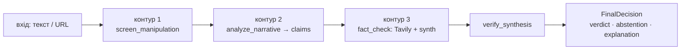
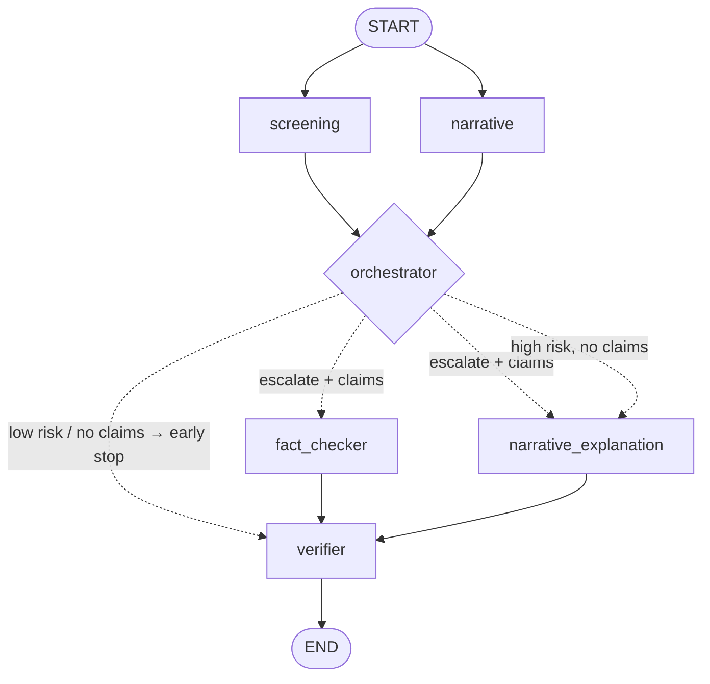
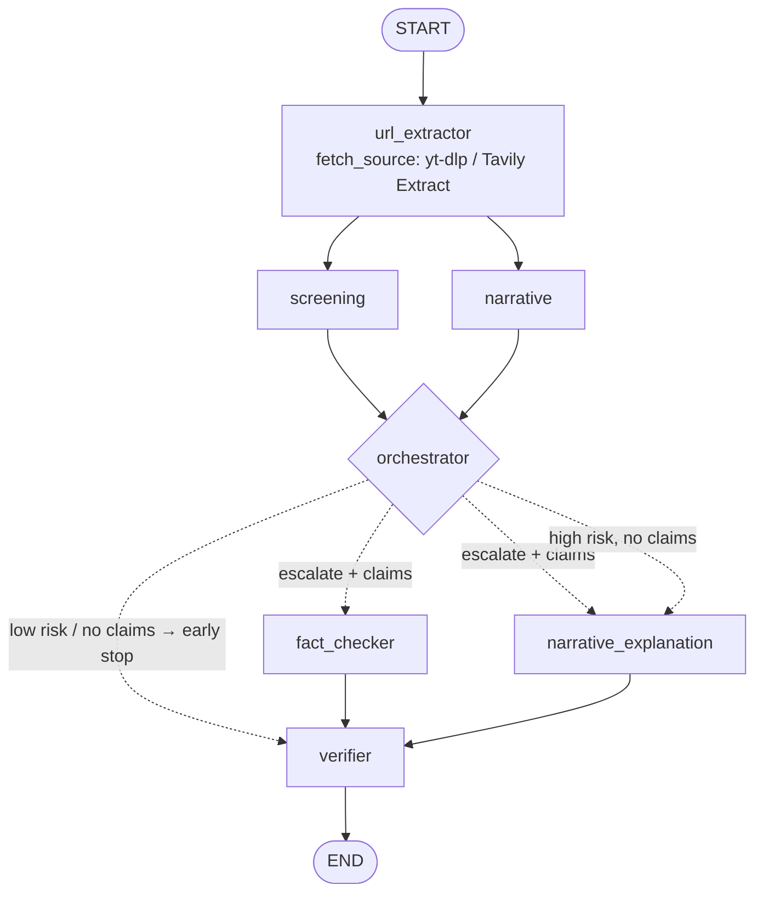
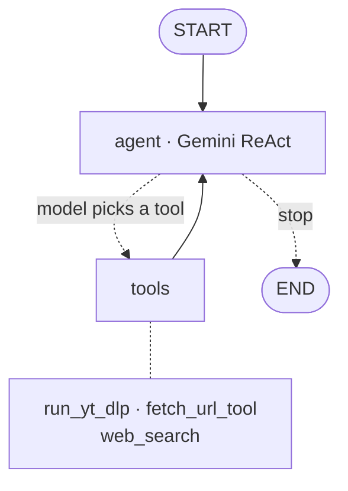
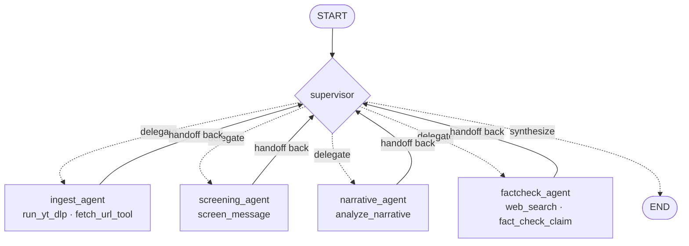

# Architecture flows

Mermaid diagrams for each architecture. All four reuse the **same three contours** — only the
orchestration differs. (Diagrams match the compiled LangGraph graphs.)

## Shared contours (the domain logic every architecture reuses)

---

## 1. Workflow — no URL extractor (`workflow_graph.py`)

Deterministic state graph. Screening + narrative run in parallel, the orchestrator does an
explicit early stop/continue. **No URL-extractor step** — a URL is screened as raw text, so the
graph returns a plausible-but-wrong verdict (fake success).

## 2. Workflow — with fetch step (`workflow_with_fetch.py`)

Same graph **plus a `url_extractor` node** that detects a URL and fetches it (yt-dlp for
YouTube, Tavily Extract for articles) before the flow runs. It works — but only because the
step was anticipated and hardcoded.

## 3. Single agent — `single_agent.py`

One ReAct agent decides at runtime which tools to call and when to stop. It only gets
fetch and search tools. It has to judge manipulation, extract claims, and write the
final conclusion on its own.

## 4. Multi-agent — `multi_agent.py`

A supervisor delegates to four specialist ReAct sub-agents, each with its own tool subset and
isolated context, then synthesizes. More spans, handoffs and coordination debt.

---

## How they compare

| | routing | fetch on URL input | determinism | trace shape |
| --- | --- | --- | --- | --- |
| workflow (no URL extractor) | fixed code | ❌ never | deterministic | flat |
| workflow (fetch step) | fixed code + url_extractor | ✅ hardcoded step | deterministic | flat + 1 |
| single agent | model-directed | ✅ if model decides | drifts at higher temp | agent → tools |
| multi-agent | supervisor handoffs | ✅ via ingest_agent | drifts at higher temp | supervisor → specialists → tools |

All four architectures emit the **same structured `FinalDecision`** (verdict + the two
dimensions: manipulation and disinformation). The workflows produce it in the `verifier` node;
the agents get a final structured-synthesis step (`contours.decision_from_text`).

Solid arrows = fixed edges; dotted arrows = conditional / model-directed routing.
